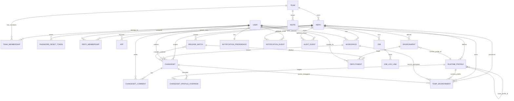

# Conman Entity Relationship Diagram

This document captures the entities currently implemented and how they relate.

## Naming note

- `Repo` is the managed configuration repository (`/api/repos`).
- `App` is a user-facing application under a repository (`/api/repos/:repoId/apps`).

## Primary ER diagram

## Key relationship fields

- `Repo.team_id -> Team.id`
- `App.repo_id -> Repo.id`
- `TeamMembership.user_id -> User.id`
- `TeamMembership.team_id -> Team.id`
- `RepoMembership.user_id -> User.id`
- `RepoMembership.repo_id -> Repo.id`
- `Invite.team_id -> Team.id`
- `Workspace.repo_id -> Repo.id`
- `Workspace.owner_user_id -> User.id`
- `Changeset.repo_id -> Repo.id`
- `Changeset.workspace_id -> Workspace.id`
- `Changeset.author_user_id -> User.id`
- `ChangesetComment.changeset_id -> Changeset.id`
- `ChangesetProfileOverride.changeset_id -> Changeset.id`
- `ChangesetProfileOverride.target_profile_id -> RuntimeProfile.id (optional)`
- `Environment.repo_id -> Repo.id`
- `Environment.runtime_profile_id -> RuntimeProfile.id (optional)`
- `RuntimeProfile.repo_id -> Repo.id`
- `RuntimeProfile.base_profile_id -> RuntimeProfile.id (optional)`
- `ReleaseBatch.repo_id -> Repo.id`
- `ReleaseBatch.ordered_changeset_ids[] -> Changeset.id`
- `Deployment.repo_id -> Repo.id`
- `Deployment.environment_id -> Environment.id`
- `Deployment.release_id -> ReleaseBatch.id`
- `TempEnvironment.repo_id -> Repo.id`
- `TempEnvironment.owner_user_id -> User.id`
- `TempEnvironment.runtime_profile_id -> RuntimeProfile.id (optional)`
- `TempEnvironment.source_id -> Workspace.id or Changeset.id (by kind)`
- `Job.repo_id -> Repo.id`
- `JobLogLine.job_id -> Job.id`
- `NotificationPreference.user_id -> User.id`
- `NotificationEvent.user_id -> User.id`
- `NotificationEvent.repo_id -> Repo.id (optional)`
- `AuditEvent.actor_user_id -> User.id (optional)`
- `AuditEvent.repo_id -> Repo.id (optional)`

## Runtime constraints worth remembering

- One workspace can have many historical changesets, but only one open changeset at a time.
- `ReleaseBatch` to `Changeset` is represented by ordered IDs, not a separate join collection.
- `TempEnvironment.source_id` is polymorphic (`workspace` or `changeset`) via `kind`.
